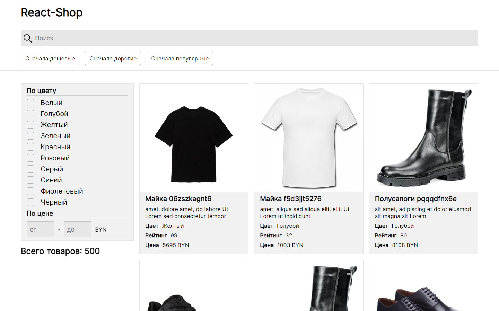

# React Shop

This project is basic example of shop.

## Preview on Desktop

## Technologies

- React
- Typescript
- SCSS for styling

## Project Features

- Generating of products, specifying quantity (default: 500)
- Sorting by price (ASC/DESC) and rating (DESC)
- Using multiple filters:
  - Filter by name
  - Filter by selected colors
  - Filter by price interval

## Local install

### Pre-requirements:

- Node and NPM installed on your device

### Installation

- Clone this repository
- Run `npm install` in cloned folder
- Run `npm start` or `npm start` to start project locally
